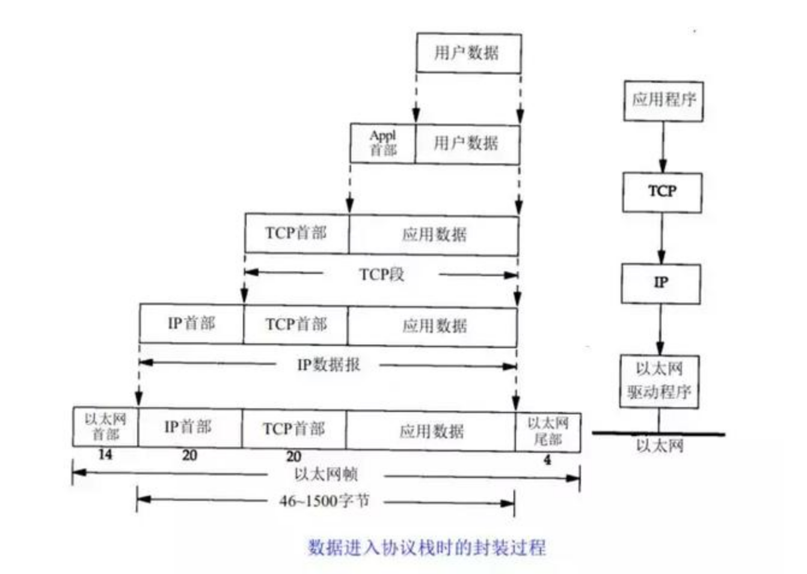
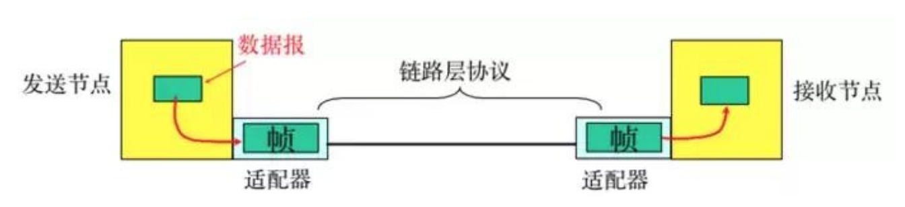
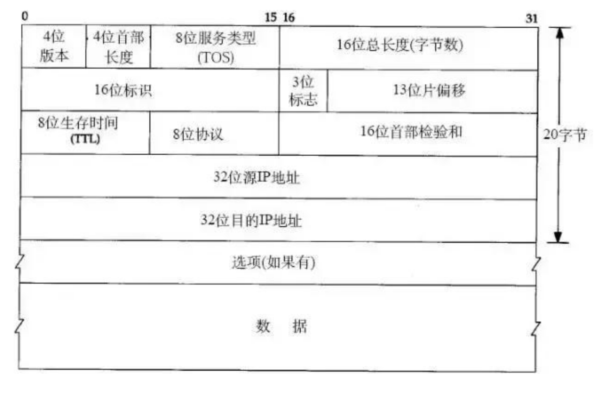
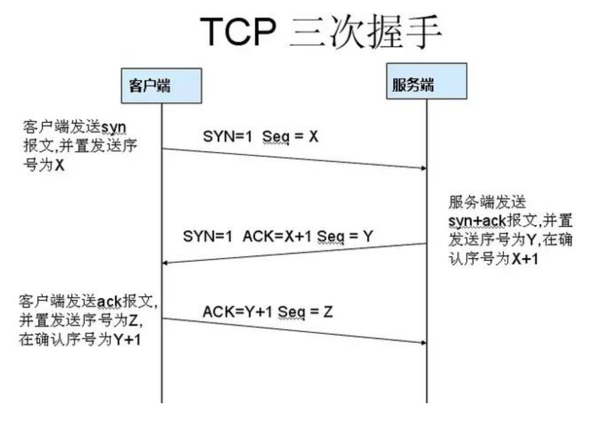
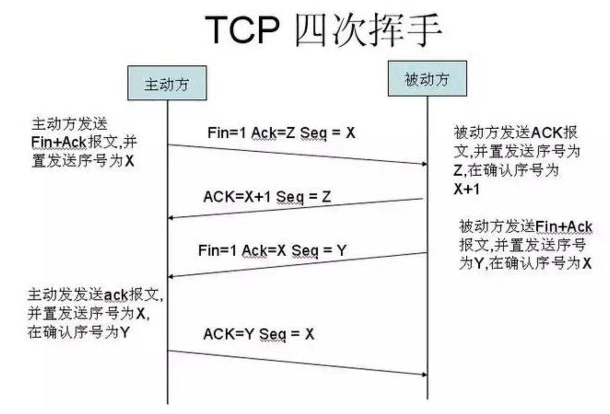

#### TCP/IP 四层模型

基于tcp/ip的参考模型，主要将协议分为四个层次，即应用层，传输层，网络层，链路层。 

tcp／ip协议簇按照层次由上至下，层层包装。
* 应用层：包括http ftp等协议
* 传输层：TCP，UDP
* 网络层：IP协议，负责对数据加上ip地址和其它数据用来确定传输目标
* 链路层：对数据加上以太网协议头，进行CRC编码。
  
如下图：
 
 
### 数据链路层
负责将0,1序列划分为帧，从一个节点传输到另一个节点。通过Mac地址为宜标识。

* 封装成帧 把网络层数据报加头和尾，封装成帧,帧头中包括源MAC地址和目的MAC地址
* 透明传输 零比特填充、转义字符
* 可靠传输 在出错率很低的链路上很少用，但是无线链路WLAN会保证可靠传输
* 差错检验:接受者进行CRC校验，如果有差错，则丢弃

### 网络层:ip协议 arp协议 RARP协议  ICMP协议
1.IP协议 ：
 IP协议是TCP/IP协议的核心，所有的TCP，UDP，IMCP，IGMP的数据都以IP数据格式传输。要注意的是，IP不是可靠的协议，这是说，IP协议没有提供一种数据未传达以后的处理机制，这被认为是上层协议：TCP或UDP要做的事情。

 IP协议头：

这里 8位生存时间hTTL代表能够传达的最大路由数量。

2.ARP协议：
    根据IP地址获取MAC地址的一种协议。
    当主机要发送一个IP包的时候，会首先查讯自己的ARP缓存，查询不到，向网络发送一个ARP协议广播包，这个广播包里面就有待查询的IP地址。如果收到广播包的主机发现自己符合条件，那么就准备好一个包含自己MAC的ARP包传送给主机。
3.RARP协议：
    根据MAC地址获取IP地址的一种协议
4.ICMP协议：
    当传送IP数据包发生错误。比如主机不可达，路由不可达等等，ICMP协议将会把错误信息封包，然后传送回给主机。给主机一个处理错误的机会，这 也就是为什么说建立在IP层以上的协议是可能做到安全的原因。

### TCP链接的建立与终止

tcp是面向连接的，无论哪一方向另一方发送数据之前，都必须建立连接。连接是通过三次握手建立的，其目的是同步连接双方的序列号和确认号并交换tcp窗口大小

第一次握手：建立连接，客户端发送连接请求，SYN置为1，序列号为x. 客户端进入SYN_SEND状态
第二次握手：服务器收到SYN报文后，需要对这个报文段进行确认，设置 ACK为 x+1,同时自己还要发送SYN请求包。将SYN置为1，序列号为y.服务端阿静SYN和ACK合在一起放入返回报文段发送给客户端。进入 SYN_RECV状态.
第三次握手：客户端受到 SYN＋ack后 。将ack number置为y+1.发送给服务端。 此时 客户端和服务端进入ESTABLISHED（established）。完成 tcp三次握手

四次挥手

第一次分手： 主机1向主机2发送一个FIN报文段 ，此时主机1进入FIN_WAIT_1状态。表明主机1没有数据要发送给主机2.
第二次分手： 主机2收到主机1的FIN报文，回复一个ACK报文。 主机1进入FIN_WAIT_2。主机2同意主机1的关闭请求
第三次分手： 主机2项主机1发送一个FIN报文。主机2进入LAST_ACK状态
第四次分手： 主机1收到主机2的FIN报文段，发送ACK报文段，然后主机1进入TIME_WAIT. 主机2 收到主机1的ACK报文以后，关闭连接。此时 主机1 等待2MSL后依然没有收到回复，则证明server端已经关闭，则主机1也可以关闭连接

