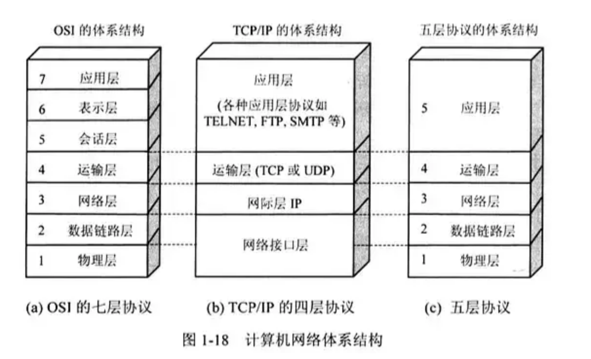

###  应用层

##### 应用层的任务是通过应用进程间的交互来完成特定网络应用。应用层协议包括： DNS , HTTP, SMTP.应用层交互的数据单元称为报文。

### 传输层

##### 负责向两台主机进程之间俄的通信提供通用的数据传输服务。

        传输层的两种协议：

         + 传输控制协议－TCP：提供面向连接的可靠数据传输服务。
         + 用户数据协议－UDP：提供无连接的不可靠的数据传输服务。
##### TCP：
* TCP 是面向连接的（需要先建立连接）；
* tcp连接是一对一的。
* 提供可靠交付的服务，传输的数据是无差错，不丢失，不重复，并且按序列到达。
* 提供全双工通信。
* 面向字节流。

##### UDP:
* 无连接
* 不保证可靠交付
* 面向报文
* 没有拥赛控制
* 支持一对一，一对多，多对一和多对多
* 首部开销小。
  
###网络层

选择合适的网间路由好玩交换节点，确保计算机通信的数据及时传送。

### 数据链路层

两台主机之间的数据传输。将网路层接下来的IP数据报组装成帧。

### 物理层

传输的数据单位是比特 ，实现相邻计算机节点之间比特流的透明传输。

### OSI七层模型
应用层，表示层，会话层，传输层，网络层，数据链路层，物理层

### TCP／IP四层模型
应用层，传输层，网络层和链路层

 ### 各层对应

 